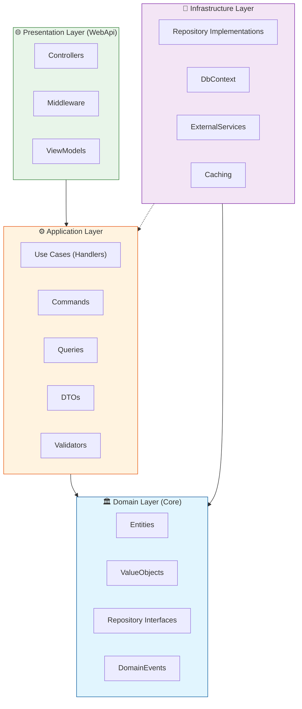
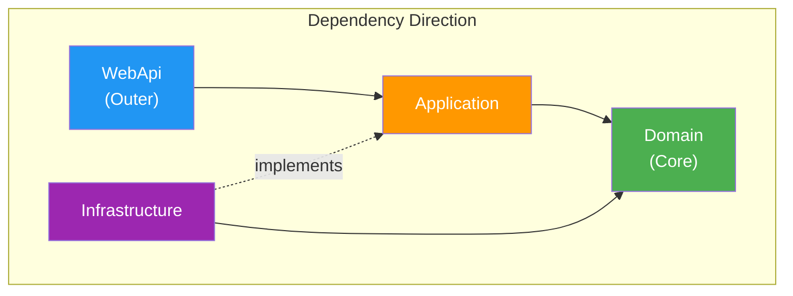

# 01. Tổng Quan Kiến Trúc Clean Architecture

## 1. Giới Thiệu

**Clean Architecture** là một kiến trúc phần mềm được đề xuất bởi Robert C. Martin (Uncle Bob), nhấn mạnh việc **tách biệt các concerns** và **dependency rule** - nơi các dependencies chỉ được phép trỏ vào trong (inward), không bao giờ trỏ ra ngoài.

## 2. Các Layer trong Clean Architecture



## 3. Dependency Rule

> [!IMPORTANT]
> **Domain Layer** không được phép reference bất kỳ layer nào khác. Đây là "core" của ứng dụng.



## 4. Chi Tiết Từng Layer

### 4.1 Domain Layer (Core)

**Trách nhiệm:**
- Chứa business entities
- Định nghĩa interfaces cho repositories
- Không phụ thuộc vào bất kỳ layer nào khác

**Thành phần:**
| Folder | Mô Tả |
|--------|-------|
| `Entities/` | Domain entities (UserEntity, ProductEntity, etc.) |
| `Enums/` | Business enumerations |
| `SeedWork/` | Generic interfaces (IGenericRepository, IUnitOfWork) |
| `Common/` | Shared configurations (AppSettings) |

### 4.2 Application Layer

**Trách nhiệm:**
- Chứa business logic (Use Cases)
- Implement CQRS pattern với Commands/Queries/Handlers
- Không biết về infrastructure details

**Thành phần:**
| Folder | Mô Tả |
|--------|-------|
| `Abstractions/` | ICommand, IQuery, IHandler interfaces |
| `Common/` | Behaviours, Exceptions, Models |
| `Features/` | Tổ chức theo modules (Auth, Users, Products, etc.) |
| `Profiles/` | AutoMapper profiles |

### 4.3 Infrastructure Layer

**Trách nhiệm:**
- Implement các interfaces từ Domain
- Xử lý database, external services
- Technical concerns (caching, logging, etc.)

**Thành phần:**
| Folder | Mô Tả |
|--------|-------|
| `Database/` | DbContext và configurations |
| `SeedWork/` | GenericRepository, UnitOfWork implementations |
| `Services/` | External service implementations |

### 4.4 WebApi Layer (Presentation)

**Trách nhiệm:**
- HTTP request handling
- Routing
- Authentication/Authorization middleware
- Exception handling

**Thành phần:**
| Folder | Mô Tả |
|--------|-------|
| `Controllers/` | API controllers |
| `Middleware/` | Custom middlewares |
| `Infrastructure/` | GlobalExceptionHandler |
| `Abstractions/` | BaseApiController |

## 5. Áp Dụng vào RetailStoreManagement

### Hiện Trạng
```
RetailStoreManagement/
├── Controllers/      # Mixed presentation logic
├── Services/         # Mixed business + infrastructure
├── Entities/         # Domain entities
├── Models/           # DTOs
├── Interfaces/       # Mixed interfaces
└── Data/             # DbContext
```

### Sau Migration
```
src/
├── Domain/           # 🏛️ Core business
├── Application/      # ⚙️ Use cases (CQRS)
├── Infrastructure/   # 🔧 Technical implementation
└── WebApi/           # 🌐 HTTP handling
```

## 6. Lợi Ích

| Lợi Ích | Mô Tả |
|---------|-------|
| **Testability** | Dễ dàng unit test từng layer độc lập |
| **Maintainability** | Code tổ chức rõ ràng, dễ maintain |
| **Flexibility** | Dễ thay đổi infrastructure (database, cache, etc.) |
| **Independence** | Domain không phụ thuộc technical details |

---

*Xem tiếp: [02_CQRS_Pattern_Guide.md](./02_CQRS_Pattern_Guide.md)*
