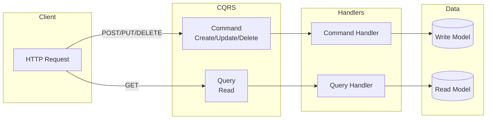
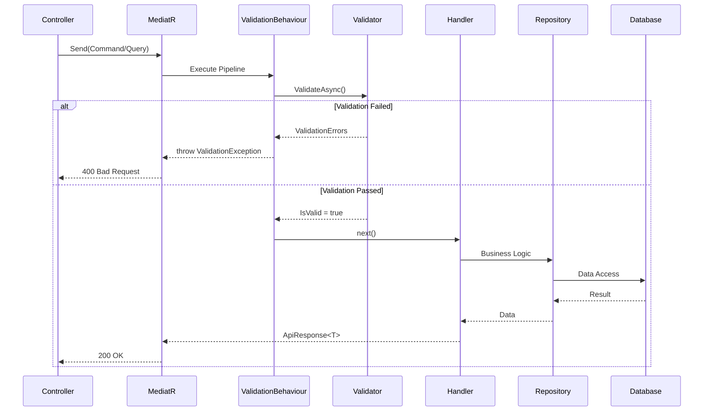

# 02. Hướng Dẫn Triển Khai CQRS Pattern

## 1. CQRS là gì?

**CQRS (Command Query Responsibility Segregation)** là một architectural pattern tách biệt các thao tác đọc (Query) và ghi (Command) dữ liệu thành hai model riêng biệt.



## 2. Thành Phần Chính

| Thành Phần | Mô Tả |
|------------|-------|
| **Command** | Thay đổi trạng thái hệ thống, không trả về dữ liệu nghiệp vụ |
| **Query** | Truy vấn dữ liệu, không thay đổi trạng thái hệ thống |
| **Handler** | Xử lý logic nghiệp vụ cho Command/Query |
| **Mediator** | Điều phối và routing giữa Command/Query và Handler |

## 3. Interfaces Cơ Bản

### 3.1 ICommand

```csharp
// File: Application/Abstractions/Messaging/ICommand.cs
using Application.Common.Models;
using MediatR;

namespace Application.Abstractions.Messaging
{
    public interface ICommand<TResponse> : IRequest<ApiResponse<TResponse>>
    {
    }
}
```

### 3.2 ICommandHandler

```csharp
// File: Application/Abstractions/Messaging/ICommandHandler.cs
using Application.Common.Models;
using MediatR;

namespace Application.Abstractions.Messaging
{
    public interface ICommandHandler<in TCommand, TResponse> 
        : IRequestHandler<TCommand, ApiResponse<TResponse>> 
        where TCommand : ICommand<TResponse>
    {
    }
}
```

### 3.3 IQuery

```csharp
// File: Application/Abstractions/Messaging/IQuery.cs
using Application.Common.Models;
using MediatR;

namespace Application.Abstractions.Messaging
{
    public interface IQuery<TResponse> : IRequest<ApiResponse<TResponse>>
    {
    }
}
```

### 3.4 IQueryHandler

```csharp
// File: Application/Abstractions/Messaging/IQueryHandler.cs
using Application.Common.Models;
using MediatR;

namespace Application.Abstractions.Messaging
{
    public interface IQueryHandler<in TQuery, TResponse> 
        : IRequestHandler<TQuery, ApiResponse<TResponse>> 
        where TQuery : IQuery<TResponse>
    {
    }
}
```

## 4. Ví Dụ Triển Khai

### 4.1 Command Example - CreateProductCommand

```csharp
// File: Application/Features/Products/Commands/CreateProductCommand.cs
using Application.Abstractions.Messaging;
using Application.Features.Products.Dtos;

namespace Application.Features.Products.Commands
{
    public class CreateProductCommand : ICommand<ProductDto>
    {
        public required string Name { get; set; }
        public required string Sku { get; set; }
        public decimal Price { get; set; }
        public int CategoryId { get; set; }
        public int SupplierId { get; set; }
    }
}
```

### 4.2 Command Handler Example

```csharp
// File: Application/Features/Products/Handlers/CreateProductCommandHandler.cs
using Application.Abstractions.Messaging;
using Application.Common.Models;
using Application.Features.Products.Commands;
using Application.Features.Products.Dtos;
using AutoMapper;
using Domain.Entities;
using Domain.SeedWork;

namespace Application.Features.Products.Handlers
{
    public class CreateProductCommandHandler(
        IUnitOfWork unitOfWork, 
        IMapper mapper) 
        : ICommandHandler<CreateProductCommand, ProductDto>
    {
        public async Task<ApiResponse<ProductDto>> Handle(
            CreateProductCommand request, 
            CancellationToken cancellationToken)
        {
            var product = mapper.Map<ProductEntity>(request);
            
            await unitOfWork.Repository<ProductEntity>().AddAsync(product);
            await unitOfWork.SaveChangesAsync();
            
            var dto = mapper.Map<ProductDto>(product);
            return ApiResponse<ProductDto>.Success(dto);
        }
    }
}
```

### 4.3 Query Example - GetProductsQuery

```csharp
// File: Application/Features/Products/Queries/GetProductsQuery.cs
using Application.Common.Models;
using Application.Features.Products.Dtos;

namespace Application.Features.Products.Queries
{
    public class GetProductsQuery : PaginationRequest<PaginatedResponse<ProductDto>>
    {
        public int? CategoryId { get; set; }
        public int? SupplierId { get; set; }
    }
}
```

### 4.4 Query Handler Example

```csharp
// File: Application/Features/Products/Handlers/GetProductsQueryHandler.cs
using Application.Abstractions.Messaging;
using Application.Common.Models;
using Application.Features.Products.Dtos;
using Application.Features.Products.Queries;
using Domain.Entities;
using Domain.SeedWork;
using Microsoft.EntityFrameworkCore;

namespace Application.Features.Products.Handlers
{
    public class GetProductsQueryHandler(IUnitOfWork unitOfWork) 
        : IQueryHandler<GetProductsQuery, PaginatedResponse<ProductDto>>
    {
        public async Task<ApiResponse<PaginatedResponse<ProductDto>>> Handle(
            GetProductsQuery request, 
            CancellationToken cancellationToken)
        {
            var query = unitOfWork.Repository<ProductEntity>()
                .GetAll()
                .AsNoTracking();

            // Apply filters
            if (request.CategoryId.HasValue)
                query = query.Where(x => x.CategoryId == request.CategoryId);

            if (!string.IsNullOrEmpty(request.SearchTerm))
                query = query.Where(x => x.Name.Contains(request.SearchTerm));

            // Project to DTO
            var dtoQuery = query.Select(x => new ProductDto
            {
                Id = x.Id,
                Name = x.Name,
                Sku = x.Sku,
                Price = x.Price
            });

            var response = await PaginatedResponse<ProductDto>.CreateAsync(
                dtoQuery, request.PageIndex, request.PageSize);
                
            return ApiResponse<PaginatedResponse<ProductDto>>.Success(response);
        }
    }
}
```

## 5. Validator Pattern

```csharp
// File: Application/Features/Products/Validators/CreateProductCommandValidator.cs
using Application.Features.Products.Commands;
using FluentValidation;

namespace Application.Features.Products.Validators
{
    public class CreateProductCommandValidator : AbstractValidator<CreateProductCommand>
    {
        public CreateProductCommandValidator()
        {
            RuleFor(x => x.Name)
                .NotEmpty().WithMessage("{PropertyName} is required.")
                .MaximumLength(200);

            RuleFor(x => x.Sku)
                .NotEmpty()
                .MaximumLength(50);

            RuleFor(x => x.Price)
                .GreaterThan(0).WithMessage("{PropertyName} must be greater than 0.");

            RuleFor(x => x.CategoryId)
                .GreaterThan(0);
        }
    }
}
```

## 6. Pipeline Behaviour

### ValidationBehaviour

```csharp
// File: Application/Common/Behaviours/ValidationBehaviour.cs
using FluentValidation;
using FluentValidation.Results;
using MediatR;

namespace Application.Common.Behaviours
{
    public class ValidationBehaviour<TRequest, TResponse> 
        : IPipelineBehavior<TRequest, TResponse> 
        where TRequest : notnull
    {
        private readonly IEnumerable<IValidator<TRequest>> _validators;
        
        public ValidationBehaviour(IEnumerable<IValidator<TRequest>> validators)
        {
            _validators = validators;
        }
        
        public async Task<TResponse> Handle(
            TRequest request, 
            RequestHandlerDelegate<TResponse> next, 
            CancellationToken cancellationToken)
        {
            if (_validators.Any())
            {
                var context = new ValidationContext<TRequest>(request);

                var validationResults = await Task.WhenAll(
                    _validators.Select(v => v.ValidateAsync(context, cancellationToken)));

                var errors = validationResults
                    .Where(r => !r.IsValid)
                    .SelectMany(r => r.Errors)
                    .ToList();

                if (errors.Count > 0)
                    throw new Exceptions.ValidationException(errors);
            }
            
            return await next();
        }
    }
}
```

## 7. CQRS Flow Diagram



## 8. Áp Dụng vào RetailStoreManagement

### Mapping Service Methods → CQRS

| Service Method | CQRS Component | Type |
|----------------|----------------|------|
| `CreateProductAsync` | `CreateProductCommand` | Command |
| `UpdateProductAsync` | `UpdateProductCommand` | Command |
| `DeleteProductAsync` | `DeleteProductCommand` | Command |
| `GetProductsAsync` | `GetProductsQuery` | Query |
| `GetProductByIdAsync` | `GetProductByIdQuery` | Query |

---

*Xem tiếp: [03_Domain_Layer.md](./03_Domain_Layer.md)*
