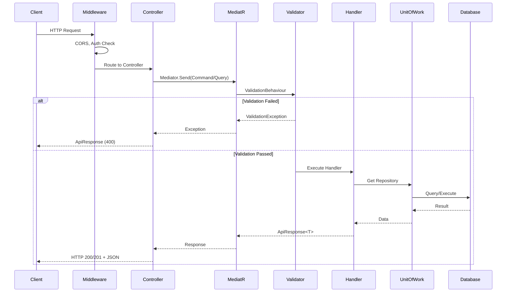

# 06. WebApi Layer - Chi Tiết Triển Khai

## 1. Tổng Quan

**WebApi Layer** là entry point của ứng dụng, xử lý:
- HTTP request/response
- Routing
- Authentication/Authorization
- Exception handling
- CORS, Compression, Caching

## 2. Cấu Trúc Thư Mục

```
src/WebApi/
├── WebApi.csproj
├── Program.cs
├── appsettings.json
├── appsettings.Development.json
├── Abstractions/
│   └── BaseApiController.cs
├── Controllers/
│   ├── Admin/
│   │   ├── ProductsController.cs
│   │   ├── CategoriesController.cs
│   │   ├── OrdersController.cs
│   │   └── ...
│   ├── Public/
│   │   └── PublicProductsController.cs
│   └── AuthController.cs
├── Infrastructure/
│   └── GlobalExceptionHandler.cs
└── Middleware/
    └── JwtMiddleware.cs (optional)
```

## 3. Project File

```xml
<!-- src/WebApi/WebApi.csproj -->
<Project Sdk="Microsoft.NET.Sdk.Web">

    <PropertyGroup>
        <TargetFramework>net9.0</TargetFramework>
        <Nullable>enable</Nullable>
        <ImplicitUsings>enable</ImplicitUsings>
    </PropertyGroup>

    <ItemGroup>
        <ProjectReference Include="..\Application\Application.csproj" />
        <ProjectReference Include="..\Infrastructure\Infrastructure.csproj" />
    </ItemGroup>

    <ItemGroup>
        <PackageReference Include="Swashbuckle.AspNetCore" Version="9.0.6" />
    </ItemGroup>

</Project>
```

## 4. Program.cs

```csharp
// File: src/WebApi/Program.cs
using Application;
using Infrastructure;
using WebApi.Infrastructure;

var builder = WebApplication.CreateBuilder(args);

// ================================
// 1. CONFIGURATION
// ================================
var corsSettings = builder.Configuration.GetSection("CorsSettings");
var allowedOrigins = corsSettings.GetSection("AllowedOrigins").Get<string[]>() 
    ?? ["http://localhost:5173"];

// ================================
// 2. SERVICES
// ================================

// CORS
builder.Services.AddCors(options =>
{
    options.AddPolicy("CorsPolicy", policy =>
    {
        policy.WithOrigins(allowedOrigins)
            .AllowAnyHeader()
            .AllowAnyMethod()
            .AllowCredentials();
    });
});

// Add Application & Infrastructure layers
builder.Services
    .AddApplication()           // MediatR, Validators, AutoMapper
    .AddInfrastructure(builder.Configuration);  // EF Core, Services

// Exception Handler
builder.Services.AddExceptionHandler<GlobalExceptionHandler>();
builder.Services.AddProblemDetails();

// Controllers
builder.Services.AddControllers()
    .AddJsonOptions(options =>
    {
        options.JsonSerializerOptions.PropertyNamingPolicy = 
            System.Text.Json.JsonNamingPolicy.CamelCase;
        options.JsonSerializerOptions.PropertyNameCaseInsensitive = true;
    });

// Authentication
var jwtSettings = builder.Configuration.GetSection("JwtSettings");
builder.Services.AddAuthentication(JwtBearerDefaults.AuthenticationScheme)
    .AddJwtBearer(options =>
    {
        options.TokenValidationParameters = new TokenValidationParameters
        {
            ValidateIssuer = true,
            ValidateAudience = true,
            ValidateLifetime = true,
            ValidateIssuerSigningKey = true,
            ValidIssuer = jwtSettings["Issuer"],
            ValidAudience = jwtSettings["Audience"],
            IssuerSigningKey = new SymmetricSecurityKey(
                Encoding.UTF8.GetBytes(jwtSettings["SecretKey"]!))
        };
    });

// Swagger
builder.Services.AddEndpointsApiExplorer();
builder.Services.AddSwaggerGen(options =>
{
    options.AddSecurityDefinition("Bearer", new OpenApiSecurityScheme
    {
        In = ParameterLocation.Header,
        Description = "Please enter a valid token",
        Name = "Authorization",
        Type = SecuritySchemeType.Http,
        BearerFormat = "JWT",
        Scheme = "Bearer"
    });

    options.AddSecurityRequirement(new OpenApiSecurityRequirement
    {
        {
            new OpenApiSecurityScheme
            {
                Reference = new OpenApiReference
                {
                    Type = ReferenceType.SecurityScheme,
                    Id = "Bearer"
                }
            },
            Array.Empty<string>()
        }
    });
});

var app = builder.Build();

// ================================
// 3. MIDDLEWARE PIPELINE
// ================================

if (app.Environment.IsDevelopment())
{
    app.UseSwagger();
    app.UseSwaggerUI();
    
    // Redirect root to Swagger
    app.Use(async (context, next) =>
    {
        if (context.Request.Path == "/")
        {
            context.Response.Redirect("/swagger");
            return;
        }
        await next();
    });
}

app.UseCors("CorsPolicy");
app.UseExceptionHandler();
app.UseAuthentication();
app.UseAuthorization();
app.MapControllers();

app.Run();
```

## 5. BaseApiController

```csharp
// File: src/WebApi/Abstractions/BaseApiController.cs
using MediatR;
using Microsoft.AspNetCore.Mvc;

namespace WebApi.Abstractions
{
    [Route("api/[controller]")]
    [ApiController]
    public abstract class BaseApiController(IMediator mediator) : ControllerBase
    {
        protected readonly IMediator Mediator = mediator;
    }
}
```

## 6. GlobalExceptionHandler

```csharp
// File: src/WebApi/Infrastructure/GlobalExceptionHandler.cs
using Application.Common.Exceptions;
using Application.Common.Models;
using Microsoft.AspNetCore.Diagnostics;
using System.Net;
using System.Text.Json;

namespace WebApi.Infrastructure
{
    public class GlobalExceptionHandler : IExceptionHandler
    {
        private readonly ILogger<GlobalExceptionHandler> _logger;
        private readonly Dictionary<Type, Func<HttpContext, Exception, Task>> _exceptionHandlers;

        public GlobalExceptionHandler(ILogger<GlobalExceptionHandler> logger)
        {
            _logger = logger;
            _exceptionHandlers = new()
            {
                { typeof(ValidationException), HandleValidationException },
                { typeof(NotFoundException), HandleNotFoundException },
                { typeof(BadRequestException), HandleBadRequestException },
                { typeof(UnauthorizedAccessException), HandleUnauthorizedAccessException },
            };
        }

        public async ValueTask<bool> TryHandleAsync(
            HttpContext httpContext, 
            Exception exception, 
            CancellationToken cancellationToken)
        {
            _logger.LogError(exception, "Exception occurred: {Message}", exception.Message);

            var exceptionType = exception.GetType();

            if (_exceptionHandlers.TryGetValue(exceptionType, out var handler))
            {
                await handler(httpContext, exception);
                return true;
            }

            // Handle unknown exceptions
            await HandleUnknownException(httpContext, exception);
            return true;
        }

        private async Task HandleValidationException(HttpContext httpContext, Exception exception)
        {
            var validationException = (ValidationException)exception;

            var response = new ApiResponse<object>
            {
                Succeeded = false,
                ResponseCode = (int)HttpStatusCode.BadRequest,
                Message = "Validation failed",
                Errors = validationException.Errors
            };

            httpContext.Response.StatusCode = (int)HttpStatusCode.BadRequest;
            httpContext.Response.ContentType = "application/json";

            await httpContext.Response.WriteAsync(JsonSerializer.Serialize(response));
        }

        private async Task HandleNotFoundException(HttpContext httpContext, Exception exception)
        {
            var response = ApiResponse<object>.NotFound(exception.Message);

            httpContext.Response.StatusCode = (int)HttpStatusCode.NotFound;
            httpContext.Response.ContentType = "application/json";

            await httpContext.Response.WriteAsync(JsonSerializer.Serialize(response));
        }

        private async Task HandleBadRequestException(HttpContext httpContext, Exception exception)
        {
            var response = ApiResponse<object>.Failure(exception.Message);

            httpContext.Response.StatusCode = (int)HttpStatusCode.BadRequest;
            httpContext.Response.ContentType = "application/json";

            await httpContext.Response.WriteAsync(JsonSerializer.Serialize(response));
        }

        private async Task HandleUnauthorizedAccessException(HttpContext httpContext, Exception exception)
        {
            var response = new ApiResponse<object>
            {
                Succeeded = false,
                ResponseCode = (int)HttpStatusCode.Unauthorized,
                Message = "Unauthorized"
            };

            httpContext.Response.StatusCode = (int)HttpStatusCode.Unauthorized;
            httpContext.Response.ContentType = "application/json";

            await httpContext.Response.WriteAsync(JsonSerializer.Serialize(response));
        }

        private async Task HandleUnknownException(HttpContext httpContext, Exception exception)
        {
            var response = new ApiResponse<object>
            {
                Succeeded = false,
                ResponseCode = (int)HttpStatusCode.InternalServerError,
                Message = "An error occurred while processing your request."
            };

            httpContext.Response.StatusCode = (int)HttpStatusCode.InternalServerError;
            httpContext.Response.ContentType = "application/json";

            await httpContext.Response.WriteAsync(JsonSerializer.Serialize(response));
        }
    }
}
```

## 7. Controllers

### 7.1 AuthController

```csharp
// File: src/WebApi/Controllers/AuthController.cs
using Application.Features.Auth.Commands;
using MediatR;
using Microsoft.AspNetCore.Authorization;
using Microsoft.AspNetCore.Mvc;
using WebApi.Abstractions;

namespace WebApi.Controllers
{
    [Route("api/[controller]")]
    public class AuthController(IMediator mediator) : BaseApiController(mediator)
    {
        [AllowAnonymous]
        [HttpPost("login")]
        public async Task<IActionResult> Login([FromBody] LoginCommand command)
        {
            return Ok(await Mediator.Send(command));
        }

        [Authorize]
        [HttpPost("logout")]
        public async Task<IActionResult> Logout([FromBody] LogoutCommand command)
        {
            return Ok(await Mediator.Send(command));
        }

        [AllowAnonymous]
        [HttpPost("refresh-token")]
        public async Task<IActionResult> RefreshToken([FromBody] RefreshTokenCommand command)
        {
            return Ok(await Mediator.Send(command));
        }
    }
}
```

### 7.2 ProductsController (Admin)

```csharp
// File: src/WebApi/Controllers/Admin/ProductsController.cs
using Application.Common.Models;
using Application.Features.Products.Commands;
using Application.Features.Products.Dtos;
using Application.Features.Products.Queries;
using MediatR;
using Microsoft.AspNetCore.Authorization;
using Microsoft.AspNetCore.Mvc;
using WebApi.Abstractions;

namespace WebApi.Controllers.Admin
{
    [Route("api/admin/products")]
    [Authorize]
    public class ProductsController(IMediator mediator) : BaseApiController(mediator)
    {
        /// <summary>
        /// Lấy danh sách sản phẩm với phân trang và filter
        /// </summary>
        [HttpGet]
        [ProducesResponseType(typeof(ApiResponse<PaginatedResponse<ProductDto>>), StatusCodes.Status200OK)]
        public async Task<IActionResult> GetProducts([FromQuery] GetProductsQuery query)
        {
            return Ok(await Mediator.Send(query));
        }

        /// <summary>
        /// Lấy chi tiết sản phẩm theo ID
        /// </summary>
        [HttpGet("{id:int}")]
        [ProducesResponseType(typeof(ApiResponse<ProductDto>), StatusCodes.Status200OK)]
        [ProducesResponseType(StatusCodes.Status404NotFound)]
        public async Task<IActionResult> GetProductById(int id)
        {
            return Ok(await Mediator.Send(new GetProductByIdQuery(id)));
        }

        /// <summary>
        /// Tạo sản phẩm mới
        /// </summary>
        [HttpPost]
        [ProducesResponseType(typeof(ApiResponse<ProductDto>), StatusCodes.Status201Created)]
        [ProducesResponseType(StatusCodes.Status400BadRequest)]
        public async Task<IActionResult> CreateProduct([FromBody] CreateProductCommand command)
        {
            var result = await Mediator.Send(command);
            return CreatedAtAction(nameof(GetProductById), new { id = result.Data?.Id }, result);
        }

        /// <summary>
        /// Cập nhật sản phẩm
        /// </summary>
        [HttpPut("{id:int}")]
        [ProducesResponseType(typeof(ApiResponse<bool>), StatusCodes.Status200OK)]
        [ProducesResponseType(StatusCodes.Status400BadRequest)]
        [ProducesResponseType(StatusCodes.Status404NotFound)]
        public async Task<IActionResult> UpdateProduct(int id, [FromBody] UpdateProductCommand command)
        {
            if (id != command.Id)
                return BadRequest("ID mismatch");
                
            return Ok(await Mediator.Send(command));
        }

        /// <summary>
        /// Xóa sản phẩm (soft delete)
        /// </summary>
        [HttpDelete("{id:int}")]
        [ProducesResponseType(typeof(ApiResponse<bool>), StatusCodes.Status200OK)]
        [ProducesResponseType(StatusCodes.Status404NotFound)]
        public async Task<IActionResult> DeleteProduct(int id)
        {
            return Ok(await Mediator.Send(new DeleteProductCommand(id)));
        }
    }
}
```

### 7.3 OrdersController (Admin)

```csharp
// File: src/WebApi/Controllers/Admin/OrdersController.cs
using Application.Common.Models;
using Application.Features.Orders.Commands;
using Application.Features.Orders.Dtos;
using Application.Features.Orders.Queries;
using MediatR;
using Microsoft.AspNetCore.Authorization;
using Microsoft.AspNetCore.Mvc;
using WebApi.Abstractions;

namespace WebApi.Controllers.Admin
{
    [Route("api/admin/orders")]
    [Authorize]
    public class OrdersController(IMediator mediator) : BaseApiController(mediator)
    {
        [HttpGet]
        [ProducesResponseType(typeof(ApiResponse<PaginatedResponse<OrderDto>>), StatusCodes.Status200OK)]
        public async Task<IActionResult> GetOrders([FromQuery] GetOrdersQuery query)
        {
            return Ok(await Mediator.Send(query));
        }

        [HttpGet("{id:int}")]
        [ProducesResponseType(typeof(ApiResponse<OrderDetailDto>), StatusCodes.Status200OK)]
        public async Task<IActionResult> GetOrderById(int id)
        {
            return Ok(await Mediator.Send(new GetOrderByIdQuery(id)));
        }

        [HttpPost]
        [ProducesResponseType(typeof(ApiResponse<OrderDto>), StatusCodes.Status201Created)]
        public async Task<IActionResult> CreateOrder([FromBody] CreateOrderCommand command)
        {
            var result = await Mediator.Send(command);
            return CreatedAtAction(nameof(GetOrderById), new { id = result.Data?.Id }, result);
        }

        [HttpPut("{id:int}/status")]
        [ProducesResponseType(typeof(ApiResponse<bool>), StatusCodes.Status200OK)]
        public async Task<IActionResult> UpdateOrderStatus(
            int id, 
            [FromBody] UpdateOrderStatusCommand command)
        {
            if (id != command.OrderId)
                return BadRequest("ID mismatch");
                
            return Ok(await Mediator.Send(command));
        }

        [HttpPost("{id:int}/items")]
        [ProducesResponseType(typeof(ApiResponse<OrderItemDto>), StatusCodes.Status201Created)]
        public async Task<IActionResult> AddOrderItem(
            int id, 
            [FromBody] AddOrderItemCommand command)
        {
            command = command with { OrderId = id };
            return Ok(await Mediator.Send(command));
        }

        [HttpDelete("{id:int}")]
        [ProducesResponseType(typeof(ApiResponse<bool>), StatusCodes.Status200OK)]
        public async Task<IActionResult> DeleteOrder(int id)
        {
            return Ok(await Mediator.Send(new DeleteOrderCommand(id)));
        }
    }
}
```

## 8. Request/Response Flow



## 9. Migration Checklist

- [ ] Tạo `WebApi.csproj` mới (hoặc refactor existing)
- [ ] Refactor `Program.cs` với DI mới
- [ ] Tạo `BaseApiController.cs`
- [ ] Tạo `GlobalExceptionHandler.cs`
- [ ] Refactor tất cả controllers để dùng MediatR:
  - [ ] AuthController
  - [ ] ProductsController
  - [ ] CategoriesController
  - [ ] OrdersController
  - [ ] CustomersController
  - [ ] SuppliersController
  - [ ] InventoryController
  - [ ] PromotionsController
  - [ ] UsersController
  - [ ] ReportsController
- [ ] Test tất cả endpoints
- [ ] Cleanup code không sử dụng

---

*Xem tiếp: [07_Migration_Checklist.md](./07_Migration_Checklist.md)*
