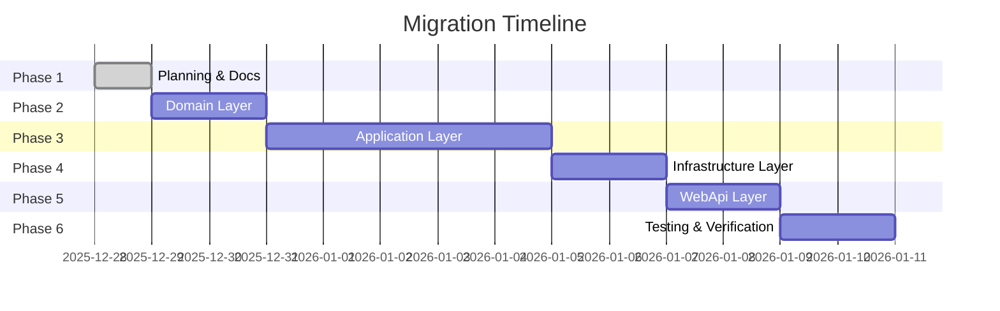

# Migration Phase: Clean Architecture + CQRS Pattern

## Mục tiêu
Migration hệ thống backend RetailStoreManagement từ kiến trúc layered truyền thống sang Clean Architecture với CQRS Pattern và MediatR.

## Tài liệu trong Phase này

| File | Mô Tả |
|------|-------|
| [01_Architecture_Overview.md](./01_Architecture_Overview.md) | Tổng quan kiến trúc Clean Architecture |
| [02_CQRS_Pattern_Guide.md](./02_CQRS_Pattern_Guide.md) | Hướng dẫn triển khai CQRS Pattern |
| [03_Domain_Layer.md](./03_Domain_Layer.md) | Chi tiết Domain Layer |
| [04_Application_Layer.md](./04_Application_Layer.md) | Chi tiết Application Layer |
| [05_Infrastructure_Layer.md](./05_Infrastructure_Layer.md) | Chi tiết Infrastructure Layer |
| [06_WebApi_Layer.md](./06_WebApi_Layer.md) | Chi tiết WebApi Layer |
| [07_Migration_Checklist.md](./07_Migration_Checklist.md) | Checklist thực hiện migration |

## Timeline

## References
- [CORE-MOBILE-APP CQRS Analysis](/media/nguyen-thanh-hung/Code3/TapHoaNho/CORE-MOBILE-APP/docs/CQRS_Pattern_Analysis.md)
- [CORE-MOBILE-APP Clean Architecture Analysis](/media/nguyen-thanh-hung/Code3/TapHoaNho/CORE-MOBILE-APP/docs/Clean_Architecture_Analysis.md)
