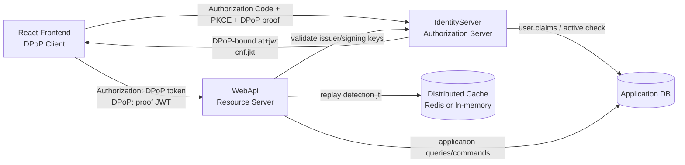
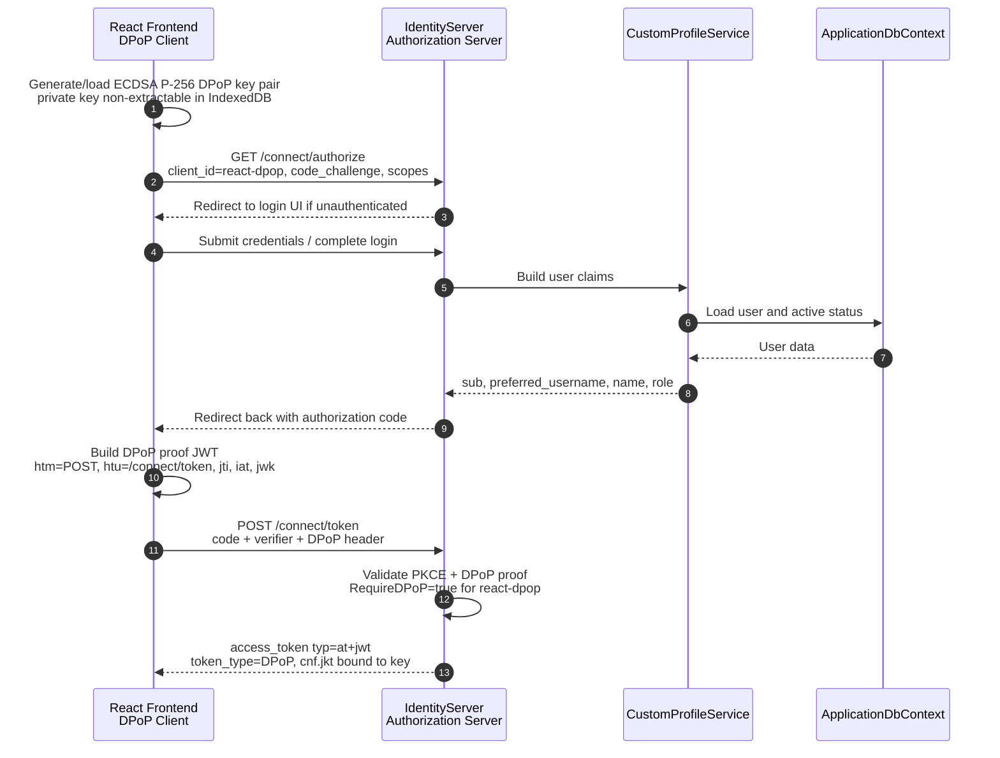
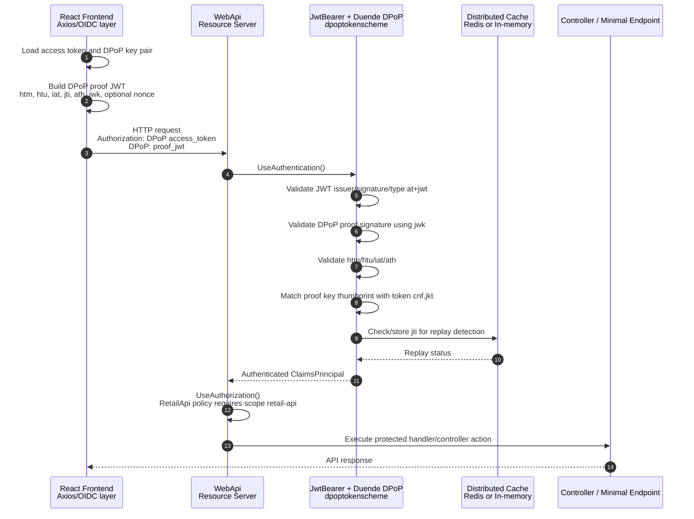
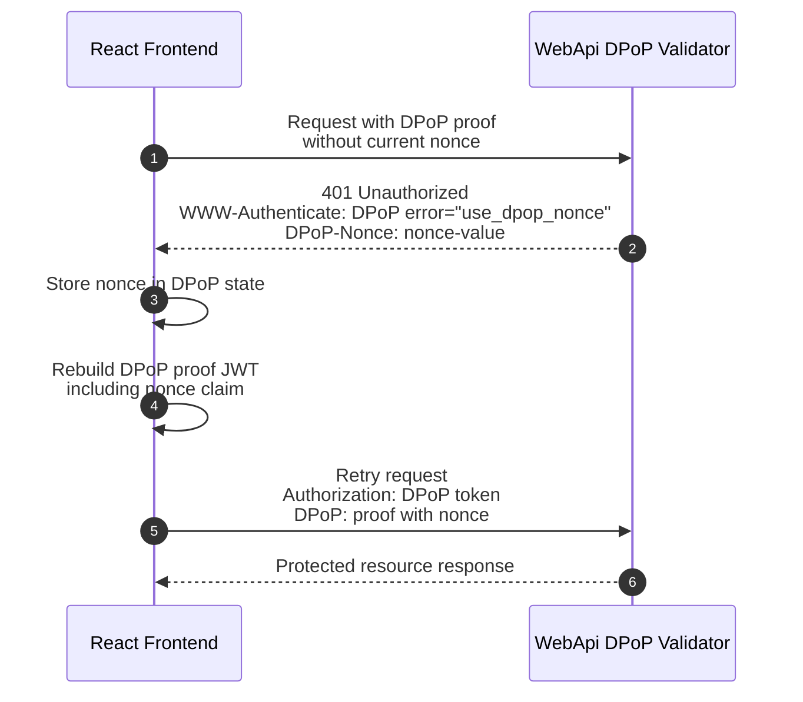
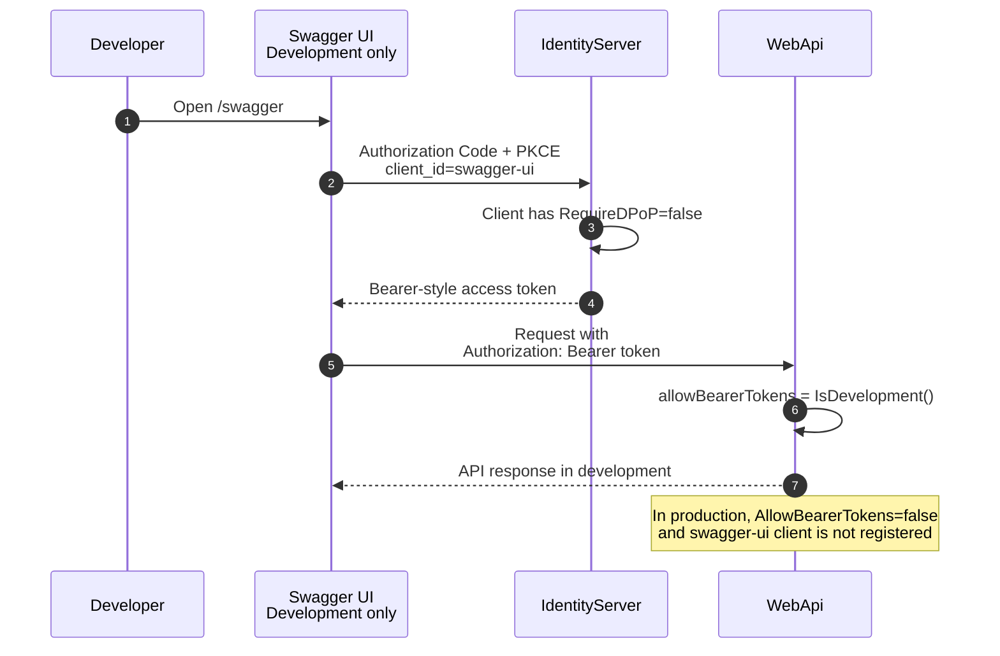

# Research: Kiến trúc hiện tại của hệ thống DPoP

**Date**: 2026-04-28T00:00:00+07:00  
**Researcher**: Claude Code  
**Git Commit**: 576f350  
**Branch**: feature/dpop-implementation  
**Repository**: TapHoaNho

## Research Question

Phân tích kiến trúc hiện tại của hệ thống DPoP, vẽ sequence diagram bằng Mermaid.

## Summary

Hệ thống hiện tại triển khai DPoP theo mô hình OAuth 2.0 Authorization Code + PKCE với ba vai trò chính:

1. **Frontend React DPoP Client**: được mô tả trong tài liệu thiết kế, chịu trách nhiệm tạo và lưu DPoP key pair trong IndexedDB, tạo DPoP proof JWT cho token request và API request.
2. **IdentityServer / Authorization Server**: cấu hình client `react-dpop` bắt buộc `RequireDPoP = true`, phát hành access token dạng `at+jwt` được ràng buộc với DPoP key.
3. **WebApi / Resource Server**: cấu hình JWT bearer scheme `dpoptokenscheme`, gắn Duende DPoP validator để kiểm tra proof JWT, `ath`, `htm`, `htu`, `iat`, `jti`, `cnf.jkt`, và replay detection.

Trong development, hệ thống cho phép thêm Bearer token thường để Swagger UI hoạt động. Trong production, `AllowBearerTokens = false`, nên API yêu cầu DPoP-bound access token kèm DPoP proof.

## Detailed Findings

### 1. IdentityServer: cấu hình OAuth client yêu cầu DPoP

File chính: `src/IdentityServer/Config.cs`

`react-dpop` là public client dùng Authorization Code + PKCE:

- `src/IdentityServer/Config.cs:33-35` định nghĩa `ClientId = "react-dpop"` và `ClientName = "React DPoP Client"`.
- `src/IdentityServer/Config.cs:38-40` cấu hình `AllowedGrantTypes = GrantTypes.Code`, `RequirePkce = true`, `RequireClientSecret = false`.
- `src/IdentityServer/Config.cs:43` bật `RequireDPoP = true`.
- `src/IdentityServer/Config.cs:58-64` cho phép các scope `openid`, `profile`, `retail-api`, `offline_access`.
- `src/IdentityServer/Config.cs:67-71` cấu hình access token 15 phút, refresh token sliding, one-time use, sliding lifetime 7 ngày, absolute lifetime 30 ngày.

Trong development, IdentityServer có thêm client `swagger-ui`:

- `src/IdentityServer/Config.cs:77-87` chỉ thêm client này khi `isDevelopment = true` và đặt `RequireDPoP = false`.
- `src/IdentityServer/Config.cs:99-106` cho phép scope `openid`, `profile`, `retail-api` và access token lifetime 1 giờ.

IdentityServer được đăng ký trong `src/IdentityServer/Program.cs`:

- `src/IdentityServer/Program.cs:19-32` gọi `AddIdentityServer(...)`, nạp identity resources, API scopes, clients từ `Config.Clients(builder.Environment.IsDevelopment())`, và đăng ký `CustomProfileService`.
- `src/IdentityServer/Program.cs:58` kích hoạt middleware bằng `app.UseIdentityServer()`.

Claims người dùng được phát hành qua `src/IdentityServer/Services/CustomProfileService.cs`:

- `src/IdentityServer/Services/CustomProfileService.cs:33-41` phát hành các claim `sub`, `preferred_username`, `name`, `role`.
- `src/IdentityServer/Services/CustomProfileService.cs:44-60` kiểm tra user active dựa trên tồn tại, chưa deleted, và chưa bị lock.

### 2. WebApi: cấu hình Resource Server validate DPoP

File chính: `src/WebApi/Program.cs`

WebApi dùng một authentication scheme tên `dpoptokenscheme`:

- `src/WebApi/Program.cs:75-80` định nghĩa scheme và gọi `AddAuthentication(DPoPScheme).AddJwtBearer(...)`.
- `src/WebApi/Program.cs:76-82` lấy authority từ `IdentityServer:Authority`, mặc định `https://localhost:5001`.
- `src/WebApi/Program.cs:87` tắt validate audience.
- `src/WebApi/Program.cs:91` chỉ chấp nhận JWT type `at+jwt`.
- `src/WebApi/Program.cs:95` đặt `MapInboundClaims = false`.
- `src/WebApi/Program.cs:99` yêu cầu HTTPS metadata ngoài development.

DPoP được gắn vào JWT bearer scheme bằng Duende extension:

- `src/WebApi/Program.cs:120` đặt `allowBearerTokens = builder.Environment.IsDevelopment()`.
- `src/WebApi/Program.cs:122-127` gọi `ConfigureDPoPTokensForScheme(DPoPScheme, opt => ...)`.
- `src/WebApi/Program.cs:124` đặt `ProofTokenIssuedAtClockSkew = 30 giây`.
- `src/WebApi/Program.cs:125` đặt `AllowBearerTokens` theo môi trường.
- `src/WebApi/Program.cs:126` bật `EnableReplayDetection = true`.

Replay detection dùng distributed cache:

- `src/WebApi/Program.cs:135-147` dùng Redis nếu `Redis:ConnectionString` có giá trị.
- `src/WebApi/Program.cs:149-152` dùng in-memory distributed cache nếu Redis connection string rỗng.

Authorization policy:

- `src/WebApi/Program.cs:154-176` định nghĩa policy `RetailApi` yêu cầu authenticated user và scope `retail-api`.
- `src/WebApi/Program.cs:175` đặt `FallbackPolicy = RetailApi`, áp dụng mặc định cho endpoint không override.
- `src/WebApi/Program.cs:273-274` kích hoạt `UseAuthentication()` và `UseAuthorization()`.

CORS expose các header liên quan đến DPoP:

- `src/WebApi/Program.cs:34-42` expose `DPoP-Nonce` và `WWW-Authenticate`, phục vụ flow nonce challenge.

Development config:

- `src/WebApi/appsettings.Development.json:11-13` đặt `IdentityServer:Authority = https://localhost:5001`.
- `src/WebApi/appsettings.Development.json:24-27` có Redis config, hiện `ConnectionString` rỗng nên runtime dùng in-memory cache.

### 3. Frontend DPoP flow hiện được mô tả trong tài liệu

Repo hiện tại không chứa source frontend `.ts/.tsx/.js/.jsx` triển khai DPoP. Các file markdown mô tả frontend flow:

- `tasks/dpop-frontend-flow.md:80-87` mô tả các module frontend dự kiến như `src/lib/oidc/dpop.ts`, `src/lib/oidc/userManager.ts`, `src/lib/api/axios.ts`.
- `tasks/dpop-frontend-flow.md:117-133` mô tả lazy key generation và lưu key pair trong IndexedDB.
- `tasks/dpop-frontend-flow.md:255-281` mô tả request interceptor tạo DPoP proof và gắn header `Authorization: DPoP <token>` cùng `DPoP: <proof_jwt>`.
- `tasks/dpop-frontend-flow.md:323-340` mô tả nonce challenge retry flow.

Theo tài liệu này, frontend tạo proof JWT với:

- Header: `typ = "dpop+jwt"`, `alg = "ES256"`, public `jwk`.
- Claims: `jti`, `htm`, `htu`, `iat`, `ath` khi có access token, và optional `nonce`.
- Private key là ECDSA P-256 non-extractable, lưu trong IndexedDB.

### 4. Swagger development flow

Swagger UI được cấu hình làm dev-only OAuth client không yêu cầu DPoP:

- `src/IdentityServer/Config.cs:77-87` tạo client `swagger-ui` trong development và đặt `RequireDPoP = false`.
- `src/WebApi/Program.cs:192-217` cấu hình Swagger OAuth2 Authorization Code flow.
- `src/WebApi/Program.cs:244-252` cấu hình Swagger UI dùng `OAuthClientId("swagger-ui")` và PKCE.
- `tasks/dpop-swagger-flow.md:69-81` mô tả vì sao Swagger không dùng DPoP.
- `tasks/dpop-swagger-flow.md:97-173` mô tả ba lớp gating trong production.

Do WebApi đặt `AllowBearerTokens = IsDevelopment()`, Bearer token từ Swagger chỉ được API chấp nhận trong development.

### 5. Test coverage hiện có

`tests/Tests.Unit/IdentityServer/ConfigTests.cs` kiểm tra cấu hình client:

- `tests/Tests.Unit/IdentityServer/ConfigTests.cs:8-23` kiểm tra production chỉ có `react-dpop`, development có `react-dpop` và `swagger-ui`.
- `tests/Tests.Unit/IdentityServer/ConfigTests.cs:26-31` kiểm tra `react-dpop` yêu cầu DPoP.
- `tests/Tests.Unit/IdentityServer/ConfigTests.cs:34-47` kiểm tra PKCE và public client.
- `tests/Tests.Unit/IdentityServer/ConfigTests.cs:50-72` kiểm tra access token lifetime, refresh token one-time use, offline access.
- `tests/Tests.Unit/IdentityServer/ConfigTests.cs:83-88` kiểm tra Swagger client không yêu cầu DPoP.

`tests/Tests.Unit/WebApi/DPoPEnforcementTests.cs` kiểm tra logic môi trường:

- `tests/Tests.Unit/WebApi/DPoPEnforcementTests.cs:7-14` development cho phép Bearer token.
- `tests/Tests.Unit/WebApi/DPoPEnforcementTests.cs:17-24` production không cho phép Bearer token.

## Architecture Documentation

### Component map

### Runtime login/token flow

### Runtime API request flow

### DPoP nonce challenge flow

### Development Swagger flow

## Code References

- `src/IdentityServer/Config.cs:33-71` - `react-dpop` OAuth client, Authorization Code + PKCE, `RequireDPoP = true`, scopes and token lifetime.
- `src/IdentityServer/Config.cs:77-106` - development-only `swagger-ui` client with `RequireDPoP = false`.
- `src/IdentityServer/Program.cs:19-32` - IdentityServer setup and client registration.
- `src/IdentityServer/Program.cs:58` - IdentityServer middleware activation.
- `src/IdentityServer/Services/CustomProfileService.cs:33-41` - issued user claims.
- `src/WebApi/Program.cs:75-100` - JWT bearer auth scheme `dpoptokenscheme`.
- `src/WebApi/Program.cs:120-127` - DPoP validation options: clock skew, bearer allowance, replay detection.
- `src/WebApi/Program.cs:135-152` - replay detection cache backend selection.
- `src/WebApi/Program.cs:154-176` - `RetailApi` authorization policy and fallback policy.
- `src/WebApi/Program.cs:273-274` - authentication and authorization middleware.
- `tests/Tests.Unit/IdentityServer/ConfigTests.cs:26-88` - tests for DPoP and Swagger client config.
- `tests/Tests.Unit/WebApi/DPoPEnforcementTests.cs:7-24` - tests for dev/prod Bearer allowance.
- `tasks/dpop-frontend-flow.md:117-133` - documented frontend key generation and IndexedDB storage.
- `tasks/dpop-frontend-flow.md:255-281` - documented frontend proof creation and request headers.
- `tasks/dpop-swagger-flow.md:97-173` - documented Swagger dev-only gating.

## Historical Context

No existing `thoughts/` documents were found before this research document was created. Related project documentation exists outside `thoughts/`:

- `tasks/dpop-migration.md` - phased DPoP migration notes and implementation inventory.
- `tasks/dpop-frontend-flow.md` - frontend DPoP design and request flow.
- `tasks/dpop-swagger-flow.md` - Swagger development auth flow.
- `docs/superpowers/specs/2026-04-19-dpop-phase4-design.md` - Phase 4 backend cleanup design.
- `docs/superpowers/plans/2026-04-19-dpop-phase4-backend-cleanup.md` - Phase 4 execution plan.
- `docs/auth/AuthMechanism.md` - older JWT Bearer auth overview.

## Related Research

- This document: `thoughts/shared/research/2026-04-28-dpop-architecture-sequence.md`

## Open Questions

- Source frontend implementation files for `src/lib/oidc/dpop.ts`, `src/lib/oidc/userManager.ts`, and `src/lib/api/axios.ts` are not present in this repository; their flow is documented in markdown only.
- Runtime behavior details of Duende's internal `ConfigureDPoPTokensForScheme` validator are represented through configuration and comments in `src/WebApi/Program.cs`, not through custom validation source in this repo.
