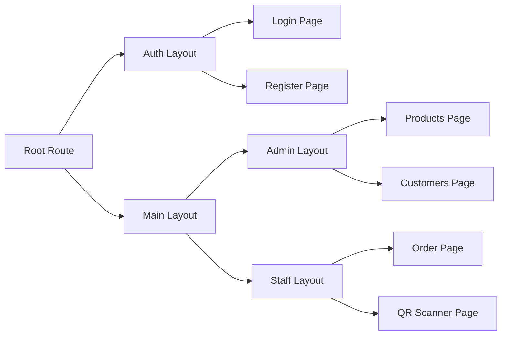
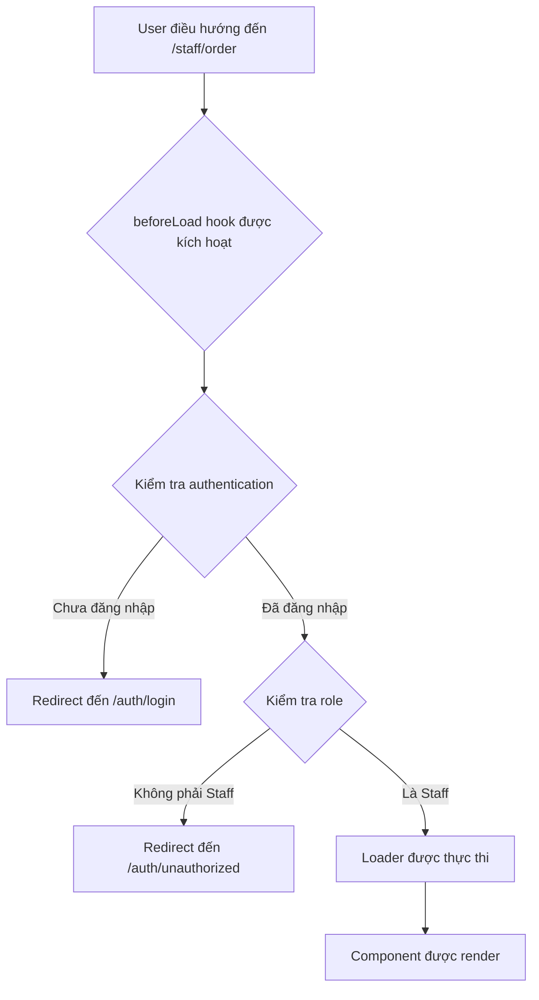
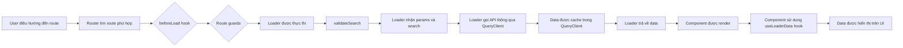
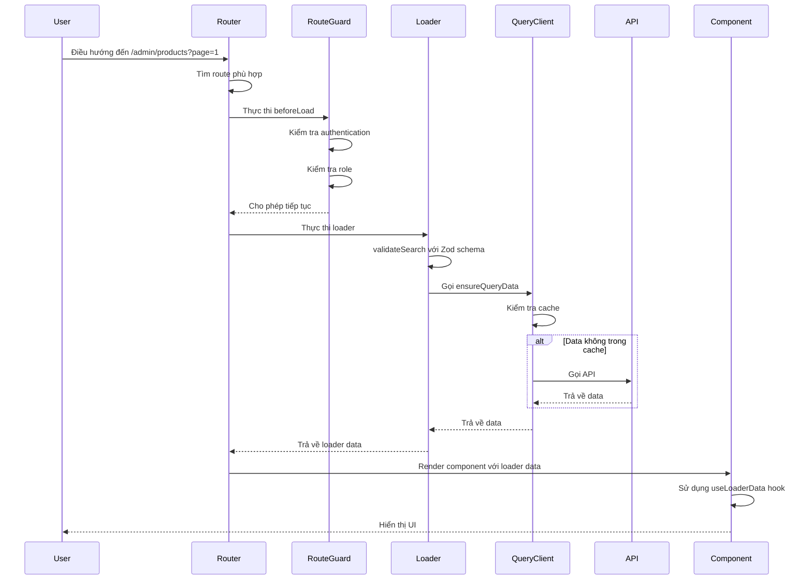
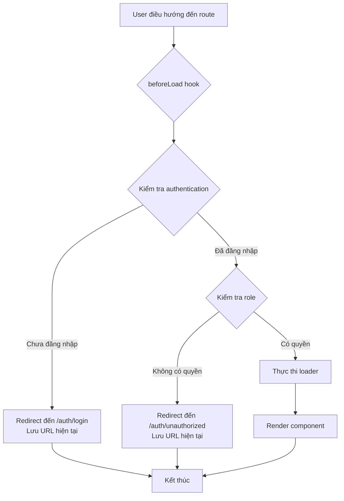

# Kiến trúc Hệ thống Routing - Shiny Carnival Frontend

## Tài liệu Kỹ thuật

---

## 1. Cấu trúc và Thiết lập (Configuration & Setup)

### 1.1 Tổng quan về TanStack Router

Dự án Shiny Carnival sử dụng **TanStack Router** (phiên bản mới nhất của TanStack Router) làm thư viện routing chính. TanStack Router là một router type-safe, data-first được thiết kế để làm việc mượt mà với TanStack Query, cung cấp các tính năng như:

- Type safety hoàn toàn cho routes, params, và search params
- Data fetching tích hợp với loaders
- Route guards và middleware
- Nested routes và layouts
- Code splitting tự động

### 1.2 Khởi tạo Router Instance

Router được khởi tạo trong file [`main.tsx`](../../src/app/main.tsx:1):

```typescript
// shiny-carnival/frontend/src/app/main.tsx
import { RouterProvider } from '@tanstack/react-router';
import { router } from './routes/routeTree';

const rootElement = document.getElementById('root')!
if (!rootElement.innerHTML) {
  const root = ReactDOM.createRoot(rootElement)
  root.render(
    <StrictMode>
      <QueryClientProvider client={queryClient}>
        <RouterProvider router={router} />
      </QueryClientProvider>
    </StrictMode>,
  )
}
```

Router instance được định nghĩa trong [`routeTree.ts`](../../src/app/routes/routeTree.ts:150):

```typescript
// shiny-carnival/frontend/src/app/routes/routeTree.ts
export const router = createRouter({
  routeTree,
  context: () => ({
    queryClient: queryClient,
  }),
});

// Khai báo router cho type-safety
declare module '@tanstack/react-router' {
  interface Register {
    router: typeof router;
  }
}
```

**Điểm quan trọng:**

1. **Router Context**: Router được khởi tạo với context chứa `queryClient` để có thể truy cập trong loaders và components
2. **Type Safety**: Khai báo module extension để TypeScript hiểu về cấu trúc router
3. **Integration với TanStack Query**: Router được bọc trong `QueryClientProvider` để sử dụng React Query

### 1.3 Chiến lược Tổ chức File Route (Code-based Routing)

Dự án sử dụng **code-based routing** thay vì file-based routing. Các routes được định nghĩa thủ công trong các tệp TypeScript, cho phép:

- Type safety tốt hơn
- Tái sử dụng logic routing
- Flexible organization
- Better control over route structure

**Cấu trúc thư mục routes:**

```
src/app/routes/
├── __root.tsx                    # Root route
├── routeTree.ts                   # Cây routing chính
├── layout/                        # Layout routes
│   ├── auth.layout.tsx
│   ├── main.layout.tsx
│   ├── admin.layout.tsx
│   └── staff.layout.tsx
├── modules/                       # Module routes
│   ├── auth.routes.ts
│   ├── home.routes.ts
│   ├── staff.routes.ts
│   ├── management/
│   │   ├── products.routes.ts
│   │   ├── customers.routes.ts
│   │   └── definition/
│   │       ├── products.definition.ts
│   │       └── customers.definition.ts
│   └── crud/
├── utils/                         # Helper functions
│   ├── routeHelpers.ts
│   └── routeGuards.ts
└── type/                          # Type definitions
    └── types.ts
```

### 1.4 Root Route Configuration

Root route được định nghĩa trong [`__root.tsx`](../../src/app/routes/__root.tsx:5):

```typescript
// shiny-carnival/frontend/src/app/routes/__root.tsx
import { createRootRoute, Outlet } from '@tanstack/react-router'
import { queryClient } from '../../lib/query/queryClient'
import type { QueryClient } from '@tanstack/react-query'

export const rootRoute = createRootRoute({
  component: () => <Outlet />,
  context: () => ({
    queryClient,
  }),
})

declare module '@tanstack/react-router' {
  interface Register {
    routerContext: {
      queryClient: QueryClient
    }
  }
}
```

**Đặc điểm:**

- `component: () => <Outlet />`: Render Outlet để hiển thị các route con
- `context`: Cung cấp queryClient cho toàn bộ router
- Type declaration: Đảm bảo type safety cho router context

### 1.5 Route Tree Structure

Cây routing được xây dựng trong [`routeTree.ts`](../../src/app/routes/routeTree.ts:144):

```typescript
// shiny-carnival/frontend/src/app/routes/routeTree.ts
const routeTree = rootRoute.addChildren([
  authLayoutRoute,   // Auth layout (không có sidebar)
  mainLayoutRoute,    // Main layout (có sidebar) - chứa home và admin routes
]);
```

**Cấu trúc cây route:**

```mermaid
flowchart TD
    Root[rootRoute] --> AuthLayout[authLayoutRoute<br/>/auth]
    Root --> MainLayout[mainLayoutRoute<br/>/]
    
    AuthLayout --> Login[login]
    AuthLayout --> Register[register]
    AuthLayout --> ForgotPassword[forgot-password]
    AuthLayout --> ResetPassword[reset-password]
    AuthLayout --> Profile[profile]
    AuthLayout --> Unauthorized[unauthorized]
    
    MainLayout --> Home[/]
    MainLayout --> AdminLayout[adminLayoutRoute<br/>/admin]
    MainLayout --> StaffLayout[staffLayoutRoute<br/>/staff]
    
    AdminLayout --> Products[products]
    AdminLayout --> Customers[customers]
    AdminLayout --> Users[users]
    AdminLayout --> Categories[categories]
    AdminLayout --> Orders[orders]
    AdminLayout --> Inventory[inventory]
    AdminLayout --> Promotions[promotions]
    AdminLayout --> Reports[reports]
    AdminLayout --> Suppliers[suppliers]
    
    StaffLayout --> StaffOrder[order]
    StaffLayout --> QRScanner[qr-scanner]
```

---

## 2. Cơ chế Định tuyến (Routing Mechanics)

### 2.1 Nested Routes

Nested routes cho phép chia nhỏ UI thành các thành phần có thể tái sử dụng. Trong dự án, nested routes được sử dụng để:

- Tạo layout chung cho các trang liên quan
- Chia sẻ data giữa các routes
- Tối ưu hóa performance bằng cách chỉ tải lại phần cần thiết

**Ví dụ về nested routes:**



### 2.2 Layout Routes

Layout routes là routes đặc biệt có chứa `<Outlet />` để hiển thị các route con. Dự án sử dụng 3 layout chính:

#### 2.2.1 Auth Layout

Được định nghĩa trong [`auth.layout.tsx`](../../src/app/routes/layout/auth.layout.tsx:7):

```typescript
// shiny-carnival/frontend/src/app/routes/layout/auth.layout.tsx
import { createRoute } from '@tanstack/react-router';
import { rootRoute } from '../__root';
import AuthLayout from '../../../layouts/AuthLayout';
import { Outlet } from '@tanstack/react-router';

export const authLayoutRoute = createRoute({
  getParentRoute: () => rootRoute,
  path: '/auth',
  component: () => (
    <AuthLayout>
      <Outlet />
    </AuthLayout>
  ),
});
```

**Đặc điểm:**

- Path: `/auth`
- Không có sidebar
- Sử dụng `AuthLayout` component
- Chứa các trang: login, register, forgot-password, reset-password, profile, unauthorized

#### 2.2.2 Main Layout

Được định nghĩa trong [`main.layout.tsx`](../../src/app/routes/layout/main.layout.tsx:7):

```typescript
// shiny-carnival/frontend/src/app/routes/layout/main.layout.tsx
import { createRoute, Outlet } from '@tanstack/react-router';
import MainLayout from '../../../layouts/MainLayout';
import { rootRoute } from '../__root';
import { requireAuth } from '../utils/routeGuards';

export const mainLayoutRoute = createRoute({
  getParentRoute: () => rootRoute,
  path: '/',
  beforeLoad: requireAuth, // Sử dụng utility function để nhất quán với các route khác
  component: () => (
    <MainLayout>
      <Outlet />
    </MainLayout>
  ),
});
```

**Đặc điểm:**

- Path: `/`
- Có sidebar
- Yêu cầu authentication
- Chứa home page và admin/staff layouts

#### 2.2.3 Admin Layout

Được định nghĩa trong [`admin.layout.tsx`](../../src/app/routes/layout/admin.layout.tsx:6):

```typescript
// shiny-carnival/frontend/src/app/routes/layout/admin.layout.tsx
import { createRoute, redirect, Outlet, type AnyRoute } from '@tanstack/react-router';
import { useAuthStore } from '../../../features/auth/store/authStore';

export function createAdminLayoutRoute(parentRoute: AnyRoute) {
  return createRoute({
    getParentRoute: () => parentRoute,
    path: 'admin',
    component: () => <Outlet />,
    beforeLoad: async () => {
      const { isAuthenticated } = useAuthStore.getState();
      if (!isAuthenticated) {
        throw redirect({
          to: '/auth/login' as any,
        });
      }
    }
  });
}
```

**Đặc điểm:**

- Path: `admin` (tương đối với parent)
- Có sidebar (thừa hưởng từ MainLayout)
- Chỉ kiểm tra authentication
- Chứa các trang quản trị: products, customers, users, categories, orders, inventory, promotions, reports, suppliers

#### 2.2.4 Staff Layout

Được định nghĩa trong [`staff.layout.tsx`](../../src/app/routes/layout/staff.layout.tsx:6):

```typescript
// shiny-carnival/frontend/src/app/routes/layout/staff.layout.tsx
import { createRoute, redirect, Outlet, type AnyRoute } from '@tanstack/react-router';
import { useAuthStore } from '../../../features/auth/store/authStore';

export function createStaffLayoutRoute(parentRoute: AnyRoute) {
  return createRoute({
    getParentRoute: () => parentRoute,
    path: 'staff',
    component: () => <Outlet />,
    beforeLoad: async () => {
      const { isAuthenticated } = useAuthStore.getState();
      if (!isAuthenticated) {
        throw redirect({
          to: '/auth/login' as any,
        });
      }
      const { user } = useAuthStore.getState();
      if (!user || user.role !== 1) {
        throw redirect({
          to: '/auth/unauthorized' as any,
        });
      }
    }
  });
}
```

**Đặc điểm:**

- Path: `staff` (tương đối với parent)
- Có sidebar (thừa hưởng từ MainLayout)
- Kiểm tra authentication và role (chỉ Staff được truy cập)
- Chứa các trang nhân viên: order, qr-scanner

### 2.3 Outlet Component

Outlet là component đặc biệt trong TanStack Router dùng để hiển thị các route con. Trong layout routes, Outlet được sử dụng để:

```typescript
// Trong layout component
component: () => (
  <MainLayout>
    <Outlet />  // Route con sẽ được render ở đây
  </MainLayout>
)
```

**Cơ chế hoạt động:**

1. Khi user điều hướng đến `/admin/products`
2. Router tìm route phù hợp: `rootRoute → mainLayoutRoute → adminLayoutRoute → productsRoute`
3. Các components được render theo thứ tự:
   - `rootRoute` component (Outlet)
   - `mainLayoutRoute` component (MainLayout + Outlet)
   - `adminLayoutRoute` component (Outlet)
   - `productsRoute` component (ProductManagementPage)

### 2.4 Route Guards và Middleware

Route guards được triển khai thông qua `beforeLoad` hook. Dự án sử dụng utility functions từ [`routeGuards.ts`](../../src/app/routes/utils/routeGuards.ts:1):

#### 2.4.1 Role Guard Function

```typescript
// shiny-carnival/frontend/src/app/routes/utils/routeGuards.ts
export function createRoleGuard(allowedRoles: AllowedRoles[]) {
  return (ctx: LoaderContext) => {
    const { isAuthenticated, isAdmin, isStaff } = useAuthStore.getState();

    // Kiểm tra authentication trước
    if (!isAuthenticated) {
      throw redirect({
        to: '/auth/login',
        search: {
          redirect: typeof window !== 'undefined' ? window.location.href : '/',
        },
      });
    }

    // Kiểm tra quyền truy cập dựa trên role
    const hasAccess = allowedRoles.some((role) => {
      if (role === 'admin') {
        return isAdmin();
      }
      if (role === 'staff') {
        return isStaff();
      }
      if (role === 'both') {
        return isAdmin() || isStaff();
      }
      return false;
    });

    // Nếu không có quyền, redirect đến trang unauthorized
    if (!hasAccess) {
      throw redirect({
        to: '/auth/unauthorized',
        search: {
          redirect: typeof window !== 'undefined' ? window.location.href : '/',
        },
      });
    }

    return {};
  };
}
```

**Đặc điểm:**

- Generic function chấp nhận danh sách roles được phép truy cập
- Kiểm tra authentication trước khi kiểm tra role
- Redirect đến login hoặc unauthorized tùy theo trường hợp
- Lưu URL hiện tại để redirect lại sau khi đăng nhập thành công

#### 2.4.2 Helper Functions

```typescript
// shiny-carnival/frontend/src/app/routes/utils/routeGuards.ts
export function requireAdmin(ctx: LoaderContext) {
  return createRoleGuard(['admin'])(ctx);
}

export function requireStaff(ctx: LoaderContext) {
  return createRoleGuard(['staff'])(ctx);
}

export function requireAuth(ctx: LoaderContext) {
  return createRoleGuard(['both'])(ctx);
}
```

#### 2.4.3 Sử dụng Route Guards

Route guards được sử dụng trong route definitions:

```typescript
// Trong products.definition.ts
export const productAdminDefinition: ManagementRouteDefinition<...> = {
  entityName: 'Sản phẩm',
  path: 'products',
  component: ProductManagementPage,
  searchSchema: productSearchSchema,
  loader: (ctx) => fetchProducts(ctx),
  allowedRoles: ['admin', 'staff'], // Admin và Staff đều truy cập được
};

// Trong customers.definition.ts
export const customerAdminDefinition: ManagementRouteDefinition<...> = {
  entityName: 'Khách hàng',
  path: 'customers',
  component: CustomerManagementPage,
  searchSchema: customerSearchSchema,
  loader: (ctx) => fetchCustomers(ctx),
  allowedRoles: ['admin'], // Chỉ Admin được truy cập
};
```

---

## 3. Quản lý Dữ liệu và Data Fetching (Data Management)

### 3.1 Loaders

Loaders là functions được thực thi trước khi route component được render, dùng để tải dữ liệu cần thiết cho route.

#### 3.1.1 Loader Function Signature

```typescript
// shiny-carnival/frontend/src/app/routes/type/types.ts
export interface LoaderContext<
  TParams = Record<string, unknown>,
  TSearch = Record<string, unknown>,
  TRouterContext = Record<string, unknown>
> {
  params: TParams;
  search: TSearch;
  context: TRouterContext;
  abortController: AbortController;
  preload: boolean;
}

export interface ModuleRouteConfig<
  TLoaderData = unknown,
  TParams = Record<string, unknown>,
  TSearch extends BaseSearch = BaseSearch,
  TRouterContext = Record<string, unknown>
> {
  path: string;
  component: RouteComponent;
  searchSchema?: z.ZodSchema<TSearch>;
  loader?: (
    ctx: LoaderContext<TParams, TSearch, TRouterContext>
  ) => Promise<TLoaderData> | TLoaderData;
  beforeLoad?: (
    ctx: LoaderContext<TParams, TSearch, TRouterContext>
  ) => Promise<Partial<TRouterContext>> | Partial<TRouterContext>;
  pendingComponent?: RouteComponent;
  errorComponent?: ErrorRouteComponent;
  meta?: {
    title?: string;
    description?: string;
    requiresAuth?: boolean;
  };
}
```

#### 3.1.2 Ví dụ Loader Function

```typescript
// shiny-carnival/frontend/src/app/routes/modules/management/definition/products.definition.ts
async function fetchProducts(ctx: LoaderContext<Record<string, never>, ProductSearch, { queryClient: QueryClient }>): Promise<{ products: ProductEntity[]; total: number }> {
  const { search, context } = ctx;
  const params = buildPagedRequest(search);

  const productsQueryOptions = createPaginatedQueryOptions<ProductEntity>(
    'products',
    productApiService,
    params,
  );

  const data = await context.queryClient.ensureQueryData(productsQueryOptions);

  return {
    products: data.items || [],
    total: data.totalCount || (data.items ? data.items.length : 0),
  };
}
```

**Đặc điểm:**

- Loader nhận `LoaderContext` với `params`, `search`, `context`, `abortController`, `preload`
- Sử dụng `context.queryClient` để gọi API thông qua TanStack Query
- `ensureQueryData` đảm bảo data được cache và không gọi lại nếu đã tồn tại
- Trả về data được type-safe

#### 3.1.3 Loader trong Route Config

```typescript
// shiny-carnival/frontend/src/app/routes/routeTree.ts
const newRoute = createRoute({
  getParentRoute: () => parentRoute,
  path: config.path,
  component: config.component,
  validateSearch: config.searchSchema,
  loaderDeps: config.searchSchema ? ({ search }) => ({ search }) : undefined,
  loader: config.loader
    ? ({ params, deps, context, abortController, preload }) =>
      config.loader!({
        params,
        search: (deps as any)?.search,
        context: context as any,
        abortController,
        preload,
      })
    : undefined,
  beforeLoad: config.beforeLoad,
  pendingComponent: config.pendingComponent,
  errorComponent: config.errorComponent,
});
```

### 3.2 Pending và Error Components

#### 3.2.1 Pending Component

```typescript
// shiny-carnival/frontend/src/components/feedback/PendingComponent.tsx
export const PendingComponent = () => (
  <div className="flex items-center justify-center min-h-screen">
    <Spin size="large" />
  </div>
);
```

Pending component được hiển thị khi loader đang tải dữ liệu.

#### 3.2.2 Error Component

```typescript
// shiny-carnival/frontend/src/components/feedback/ErrorComponent.tsx
export const ErrorComponent = ({ error }: { error: Error }) => (
  <Result
    status="error"
    title="Đã xảy ra lỗi"
    subTitle={error.message}
    extra={
      <Button type="primary" onClick={() => window.location.reload()}>
        Tải lại trang
      </Button>
    }
  />
);
```

Error component được hiển thị khi loader gặp lỗi.

### 3.3 Caching và Invalidation

Dự án sử dụng TanStack Query để quản lý caching và invalidation:

#### 3.3.1 Caching Strategy

```typescript
// shiny-carnival/frontend/src/lib/query/queryOptionsFactory.ts
export function createPaginatedQueryOptions<T>(
  queryKey: string,
  apiService: any,
  params: PagedRequest,
) {
  return queryOptions({
    queryKey: [queryKey, params],
    queryFn: () => apiService.getAll(params),
    staleTime: 5 * 60 * 1000, // 5 phút
    gcTime: 10 * 60 * 1000, // 10 phút
  });
}
```

**Đặc điểm:**

- `staleTime`: Data được coi là fresh trong 5 phút
- `gcTime`: Data được giữ trong cache trong 10 phút
- `queryKey`: Được xây dựng từ query name và params

#### 3.3.2 Invalidation Strategy

Data được invalidate khi:

1. User thực hiện action (create, update, delete)
2. User logout
3. Thời gian staleTime hết hạn

```typescript
// Ví dụ: Invalidate sau khi tạo sản phẩm
const createMutation = useMutation({
  mutationFn: productApiService.create,
  onSuccess: () => {
    queryClient.invalidateQueries({ queryKey: ['products'] });
  },
});
```

### 3.4 Actions

Actions được sử dụng để thực hiện các tác vụ thay đổi dữ liệu (create, update, delete). Dự án sử dụng TanStack Query mutations:

```typescript
// Ví dụ: Mutation để tạo sản phẩm
const createMutation = useMutation({
  mutationFn: productApiService.create,
  onSuccess: () => {
    message.success('Tạo sản phẩm thành công');
    queryClient.invalidateQueries({ queryKey: ['products'] });
    navigate({ to: '/admin/products' });
  },
  onError: (error) => {
    message.error('Tạo sản phẩm thất bại');
  },
});
```

---

## 4. Xử lý Tham số và Type Safety (Parameters & Validation)

### 4.1 Route Params

Route params là các tham số động trong URL path, ví dụ: `/admin/products/:id`.

```typescript
// Ví dụ: Route với params
const productDetailRoute = createRoute({
  getParentRoute: () => adminLayoutRoute,
  path: 'products/$id',
  component: ProductDetailPage,
  loader: async ({ params }) => {
    const productId = params.id;
    const product = await productService.getById(productId);
    return { product };
  },
});
```

### 4.2 Search Params

Search params là các tham số trong URL query string, ví dụ: `/admin/products?page=1&pageSize=10`.

#### 4.2.1 Search Schema với Zod

```typescript
// shiny-carnival/frontend/src/app/routes/type/types.ts
export const baseSearchSchema = z.object({
  page: z.number().catch(1),
  pageSize: z.number().catch(10),
  search: z.string().optional(),
});

export type BaseSearch = z.infer<typeof baseSearchSchema>;
```

#### 4.2.2 Extended Search Schema

```typescript
// shiny-carnival/frontend/src/app/routes/modules/management/definition/products.definition.ts
const productSearchSchema = baseSearchSchema.extend({
  categoryId: z.number().optional(),
  supplierId: z.number().optional(),
  minPrice: z.number().optional(),
  maxPrice: z.number().optional(),
  onlyLowStock: z.boolean().optional(),
  sortField: z.string().catch('id'),
  sortOrder: z.enum(['ascend', 'descend']).catch('descend'),
});

export type ProductSearch = z.infer<typeof productSearchSchema>;
```

**Đặc điểm:**

- Mở rộng từ `baseSearchSchema` để tái sử dụng
- Sử dụng `.catch()` để cung cấp giá trị mặc định
- Type inference với `z.infer`

#### 4.2.3 Validate Search Params

```typescript
// shiny-carnival/frontend/src/app/routes/routeTree.ts
const newRoute = createRoute({
  getParentRoute: () => parentRoute,
  path: config.path,
  component: config.component,
  validateSearch: config.searchSchema, // Validate search params
  loaderDeps: config.searchSchema ? ({ search }) => ({ search }) : undefined,
  loader: config.loader
    ? ({ params, deps, context, abortController, preload }) =>
      config.loader!({
        params,
        search: (deps as any)?.search, // Search params đã được validate
        context: context as any,
        abortController,
        preload,
      })
    : undefined,
});
```

### 4.3 Type Safety

TanStack Router cung cấp type safety hoàn toàn cho:

#### 4.3.1 Loader Data Type

```typescript
// shiny-carnival/frontend/src/app/routes/modules/management/definition/products.definition.ts
export const productAdminDefinition: ManagementRouteDefinition<
  { products: ProductEntity[]; total: number },     // Kiểu loader data
  ProductSearch,         // Kiểu search params
  { queryClient: QueryClient }     // Kiểu router context
> = {
  entityName: 'Sản phẩm',
  path: 'products',
  component: ProductManagementPage,
  searchSchema: productSearchSchema,
  loader: (ctx) => fetchProducts(ctx),
  allowedRoles: ['admin', 'staff'],
};
```

#### 4.3.2 Use Loader Data Hook

```typescript
// Trong component
import { useLoaderData } from '@tanstack/react-router';

function ProductManagementPage() {
  const { products, total } = useLoaderData({ 
    from: '/admin/products' 
  });
  
  // products: ProductEntity[]
  // total: number
  
  return (
    <div>
      <Table dataSource={products} />
      <Pagination total={total} />
    </div>
  );
}
```

#### 4.3.3 Use Search Params Hook

```typescript
// Trong component
import { useSearch } from '@tanstack/react-router';

function ProductManagementPage() {
  const search = useSearch({ 
    from: '/admin/products' 
  });
  
  // search: ProductSearch (đã được type-safe)
  
  return (
    <div>
      <Input 
        value={search.search} 
        onChange={(e) => navigate({ 
          to: '/admin/products', 
          search: { ...search, search: e.target.value } 
        })} 
      />
    </div>
  );
}
```

### 4.4 Helper Types

```typescript
// shiny-carnival/frontend/src/app/routes/type/types.ts
// Helper type để extract loader data type
export type ExtractLoaderData<T> = T extends ModuleRouteConfig<infer U, any, any, any> ? U : never;

// Helper type để extract params type
export type ExtractParams<T> = T extends ModuleRouteConfig<any, infer U, any, any> ? U : never;

// Helper type để extract search type
export type ExtractSearch<T> = T extends ModuleRouteConfig<any, any, infer U, any> ? U : never;
```

---

## 5. Tương tác Hệ thống (System Integration)

### 5.1 Global State với Auth Store

Router tương tác với global state thông qua `useAuthStore`:

```typescript
// shiny-carnival/frontend/src/app/routes/utils/routeGuards.ts
import { useAuthStore } from '../../../features/auth/store/authStore';

export function createRoleGuard(allowedRoles: AllowedRoles[]) {
  return (ctx: LoaderContext) => {
    const { isAuthenticated, isAdmin, isStaff } = useAuthStore.getState();
    // ...
  };
}
```

**Đặc điểm:**

- Sử dụng `useAuthStore.getState()` để truy cập state trong route guards
- Không cần component để truy cập store
- State được chia sẻ giữa router và components

### 5.2 UI Components

Router tương tác với UI components thông qua:

#### 5.2.1 Layout Components

```typescript
// shiny-carnival/frontend/src/layouts/MainLayout.tsx
import { Outlet, useNavigate } from '@tanstack/react-router';

function MainLayout() {
  const navigate = useNavigate();
  
  return (
    <Layout>
      <Sider>
        <Menu onClick={({ key }) => navigate({ to: key })}>
          <Menu.Item key="/admin/products">Sản phẩm</Menu.Item>
          <Menu.Item key="/admin/customers">Khách hàng</Menu.Item>
        </Menu>
      </Sider>
      <Content>
        <Outlet />
      </Content>
    </Layout>
  );
}
```

#### 5.2.2 Navigation Components

```typescript
// Sử dụng Link component
import { Link } from '@tanstack/react-router';

<Link to="/admin/products">Sản phẩm</Link>

// Sử dụng useNavigate hook
import { useNavigate } from '@tanstack/react-router';

function ProductList() {
  const navigate = useNavigate();
  
  return (
    <Button onClick={() => navigate({ to: '/admin/products/create' })}>
      Tạo sản phẩm mới
    </Button>
  );
}
```

### 5.3 Custom Hooks

Dự án sử dụng các custom hooks để tương tác với router:

#### 5.3.1 useLoaderData Hook

```typescript
import { useLoaderData } from '@tanstack/react-router';

function ProductDetailPage() {
  const { product } = useLoaderData({ from: '/admin/products/$id' });
  
  return (
    <div>
      <h1>{product.name}</h1>
      <p>{product.description}</p>
    </div>
  );
}
```

#### 5.3.2 useSearch Hook

```typescript
import { useSearch } from '@tanstack/react-router';

function ProductListPage() {
  const search = useSearch({ from: '/admin/products' });
  
  return (
    <div>
      <Input 
        placeholder="Tìm kiếm sản phẩm"
        value={search.search}
        onChange={(e) => navigate({ 
          to: '/admin/products', 
          search: { ...search, search: e.target.value } 
        })}
      />
    </div>
  );
}
```

#### 5.3.3 useNavigate Hook

```typescript
import { useNavigate } from '@tanstack/react-router';

function ProductForm() {
  const navigate = useNavigate();
  
  const handleSubmit = async (values: ProductFormData) => {
    await createProduct(values);
    navigate({ to: '/admin/products' });
  };
  
  return (
    <Form onSubmit={handleSubmit}>
      {/* Form fields */}
    </Form>
  );
}
```

### 5.4 TanStack Query Integration

Router tích hợp chặt chẽ với TanStack Query:

#### 5.4.1 QueryClient trong Router Context

```typescript
// shiny-carnival/frontend/src/app/routes/routeTree.ts
export const router = createRouter({
  routeTree,
  context: () => ({
    queryClient: queryClient,
  }),
});
```

#### 5.4.2 Sử dụng QueryClient trong Loaders

```typescript
async function fetchProducts(ctx: LoaderContext<..., ..., { queryClient: QueryClient }>) {
  const { search, context } = ctx;
  
  const productsQueryOptions = createPaginatedQueryOptions<ProductEntity>(
    'products',
    productApiService,
    buildPagedRequest(search),
  );

  const data = await context.queryClient.ensureQueryData(productsQueryOptions);
  
  return {
    products: data.items || [],
    total: data.totalCount || 0,
  };
}
```

#### 5.4.3 Invalidation sau Mutations

```typescript
const createMutation = useMutation({
  mutationFn: productApiService.create,
  onSuccess: () => {
    queryClient.invalidateQueries({ queryKey: ['products'] });
    navigate({ to: '/admin/products' });
  },
});
```

---

## 6. Minh họa Thực tế (Practical Examples)

### 6.1 Ví dụ 1: Tạo Route CRUD Cho Sản Phẩm

#### 6.1.1 Định nghĩa Search Schema

```typescript
// shiny-carnival/frontend/src/app/routes/modules/management/definition/products.definition.ts
import { z } from 'zod';
import { baseSearchSchema } from '../../../type/types';

const productSearchSchema = baseSearchSchema.extend({
  categoryId: z.number().optional(),
  supplierId: z.number().optional(),
  minPrice: z.number().optional(),
  maxPrice: z.number().optional(),
  onlyLowStock: z.boolean().optional(),
  sortField: z.string().catch('id'),
  sortOrder: z.enum(['ascend', 'descend']).catch('descend'),
});

export type ProductSearch = z.infer<typeof productSearchSchema>;
```

#### 6.1.2 Định nghĩa Loader Function

```typescript
// shiny-carnival/frontend/src/app/routes/modules/management/definition/products.definition.ts
function buildPagedRequest(search: ProductSearch): PagedRequest {
  return {
    page: search.page || 1,
    pageSize: search.pageSize || 10,
    search: search.search,
    sortBy: search.sortField === 'productName' ? 'ProductName' :
      search.sortField === 'price' ? 'Price' :
        search.sortField === 'createdAt' ? 'CreatedAt' : 'Id',
    sortDesc: search.sortOrder === 'descend',
    ...(search.categoryId !== undefined && { categoryId: search.categoryId }),
    ...(search.supplierId !== undefined && { supplierId: search.supplierId }),
    ...(search.minPrice !== undefined && { minPrice: search.minPrice }),
    ...(search.maxPrice !== undefined && { maxPrice: search.maxPrice }),
    ...(search.onlyLowStock !== undefined && { onlyLowStock: search.onlyLowStock }),
  };
}

async function fetchProducts(ctx: LoaderContext<Record<string, never>, ProductSearch, { queryClient: QueryClient }>): Promise<{ products: ProductEntity[]; total: number }> {
  const { search, context } = ctx;
  const params = buildPagedRequest(search);

  const productsQueryOptions = createPaginatedQueryOptions<ProductEntity>(
    'products',
    productApiService,
    params,
  );

  const data = await context.queryClient.ensureQueryData(productsQueryOptions);

  return {
    products: data.items || [],
    total: data.totalCount || (data.items ? data.items.length : 0),
  };
}
```

#### 6.1.3 Định nghĩa Route Definition

```typescript
// shiny-carnival/frontend/src/app/routes/modules/management/definition/products.definition.ts
export const productAdminDefinition: ManagementRouteDefinition<
  { products: ProductEntity[]; total: number },
  ProductSearch,
  { queryClient: QueryClient }
> = {
  entityName: 'Sản phẩm',
  path: 'products',
  component: ProductManagementPage,
  searchSchema: productSearchSchema,
  loader: (ctx) => fetchProducts(ctx),
  allowedRoles: ['admin', 'staff'],
};
```

#### 6.1.4 Tạo Route Config

```typescript
// shiny-carnival/frontend/src/app/routes/modules/management/products.routes.ts
import { generateManagementRouteConfigs } from '../../utils/routeHelpers';
import { productAdminDefinition } from './definition/products.definition';
import type { ModuleRoutes } from '../../type/types';

export const productsRoutes: object = {};

const generatedModule: ModuleRoutes<any> = {
  moduleName: 'products',
  basePath: '/products',
  routes: generateManagementRouteConfigs(productAdminDefinition),
};

Object.assign(productsRoutes, generatedModule);
```

#### 6.1.5 Sử dụng Route trong Component

```typescript
// shiny-carnival/frontend/src/features/products/pages/ProductManagementPage.tsx
import { useLoaderData, useSearch } from '@tanstack/react-router';
import { useNavigate } from '@tanstack/react-router';

function ProductManagementPage() {
  const { products, total } = useLoaderData({ from: '/admin/products' });
  const search = useSearch({ from: '/admin/products' });
  const navigate = useNavigate();
  
  const handlePageChange = (page: number) => {
    navigate({ 
      to: '/admin/products', 
      search: { ...search, page } 
    });
  };
  
  return (
    <div>
      <Button onClick={() => navigate({ to: '/admin/products/create' })}>
        Tạo sản phẩm mới
      </Button>
      <Table 
        dataSource={products} 
        pagination={{
          current: search.page,
          pageSize: search.pageSize,
          total,
          onChange: handlePageChange,
        }}
      />
    </div>
  );
}
```

### 6.2 Ví dụ 2: Tạo Route với Route Guard

#### 6.2.1 Định nghĩa Route với Role Guard

```typescript
// shiny-carnival/frontend/src/app/routes/modules/staff.routes.ts
import type { ModuleRoutes } from '../type/types';
import { StaffOrderPage } from '../../../features/orders/pages/StaffOrderPage';
import { createRoleGuard } from '../utils/routeGuards';

export const staffRoutes: ModuleRoutes<any> = {
  moduleName: 'staff',
  basePath: '/staff',
  routes: [
    {
      path: '/staff',
      children: [
        {
          path: 'order',
          component: StaffOrderPage,
          beforeLoad: createRoleGuard(['staff']), // Chỉ Staff được truy cập
          meta: {
            title: 'Tạo đơn hàng',
            description: 'Trang tạo đơn hàng cho nhân viên',
            requiresAuth: true,
          },
        },
      ],
    },
  ],
};
```

#### 6.2.2 Luồng Hoạt Động của Route Guard



### 6.3 Ví dụ 3: Luồng Dữ liệu từ Loader đến Component



---

## 7. Sơ đồ Tổng quan về Kiến trúc Routing

### 7.1 Cấu trúc Route Tree

```mermaid
flowchart TD
    Root[rootRoute<br/>Outlet + QueryClient Context] --> AuthLayout[authLayoutRoute<br/>/auth<br/>AuthLayout + Outlet]
    Root --> MainLayout[mainLayoutRoute<br/>/<br/>beforeLoad: requireAuth<br/>MainLayout + Outlet]
    
    AuthLayout --> Login[login<br/>LoginPage]
    AuthLayout --> Register[register<br/>RegisterPage]
    AuthLayout --> ForgotPassword[forgot-password<br/>ForgotPasswordPage]
    AuthLayout --> ResetPassword[reset-password<br/>ResetPasswordPage]
    AuthLayout --> Profile[profile<br/>ProfilePage<br/>beforeLoad: check auth]
    AuthLayout --> Unauthorized[unauthorized<br/>UnauthorizedPage]
    
    MainLayout --> Home[/<br/>HomePage]
    MainLayout --> AdminLayout[adminLayoutRoute<br/>admin<br/>beforeLoad: check auth<br/>Outlet]
    MainLayout --> StaffLayout[staffLayoutRoute<br/>staff<br/>beforeLoad: check auth + role<br/>Outlet]
    
    AdminLayout --> Products[products<br/>ProductManagementPage<br/>loader: fetchProducts<br/>allowedRoles: admin, staff]
    AdminLayout --> Customers[customers<br/>CustomerManagementPage<br/>loader: fetchCustomers<br/>allowedRoles: admin]
    AdminLayout --> Users[users<br/>UserManagementPage<br/>loader: fetchUsers<br/>allowedRoles: admin]
    AdminLayout --> Categories[categories<br/>CategoryManagementPage<br/>loader: fetchCategories<br/>allowedRoles: admin]
    AdminLayout --> Orders[orders<br/>OrderManagementPage<br/>loader: fetchOrders<br/>allowedRoles: admin]
    AdminLayout --> Inventory[inventory<br/>InventoryManagementPage<br/>loader: fetchInventory<br/>allowedRoles: admin]
    AdminLayout --> Promotions[promotions<br/>PromotionManagementPage<br/>loader: fetchPromotions<br/>allowedRoles: admin]
    AdminLayout --> Reports[reports<br/>ReportManagementPage<br/>loader: fetchReports<br/>allowedRoles: admin]
    AdminLayout --> Suppliers[suppliers<br/>SupplierManagementPage<br/>loader: fetchSuppliers<br/>allowedRoles: admin]
    
    StaffLayout --> StaffOrder[order<br/>StaffOrderPage<br/>beforeLoad: requireStaff]
    StaffLayout --> QRScanner[qr-scanner<br/>QRScannerPage<br/>beforeLoad: requireStaff]
```

### 7.2 Luồng Dữ liệu Routing



### 7.3 Luồng Route Guard



---

## 8. Các Pattern và Best Practices

### 8.1 Pattern 1: Hierarchical Route Configuration

Dự án sử dụng hierarchical route configuration để tổ chức routes:

```typescript
// shiny-carnival/frontend/src/app/routes/type/types.ts
export type HierarchicalModuleRouteConfig = ModuleRouteConfig & {
  children?: HierarchicalModuleRouteConfig[];
};
```

**Lợi ích:**

- Tổ chức routes theo cấu trúc cây
- Chia sẻ logic giữa các routes
- Tái sử dụng route guards và loaders

### 8.2 Pattern 2: Route Definition Pattern

Dự án sử dụng route definition pattern để tách biệt giữa config và implementation:

```typescript
// Definition file
export const productAdminDefinition: ManagementRouteDefinition<...> = {
  entityName: 'Sản phẩm',
  path: 'products',
  component: ProductManagementPage,
  searchSchema: productSearchSchema,
  loader: (ctx) => fetchProducts(ctx),
  allowedRoles: ['admin', 'staff'],
};

// Route file
export const productsRoutes: ModuleRoutes<any> = {
  moduleName: 'products',
  basePath: '/products',
  routes: generateManagementRouteConfigs(productAdminDefinition),
};
```

**Lợi ích:**

- Tách biệt giữa config và implementation
- Dễ dàng test và maintain
- Tái sử dụng logic routing

### 8.3 Pattern 3: Route Guard Pattern

Dự án sử dụng route guard pattern để kiểm soát quyền truy cập:

```typescript
// Generic guard function
export function createRoleGuard(allowedRoles: AllowedRoles[]) {
  return (ctx: LoaderContext) => {
    // Logic kiểm tra quyền truy cập
  };
}

// Helper functions
export const requireAdmin = createRoleGuard(['admin']);
export const requireStaff = createRoleGuard(['staff']);
export const requireAuth = createRoleGuard(['both']);
```

**Lợi ích:**

- Tái sử dụng logic kiểm tra quyền truy cập
- Dễ dàng mở rộng
- Type-safe

### 8.4 Pattern 4: Loader Pattern

Dự án sử dụng loader pattern để tải dữ liệu:

```typescript
// Loader function
async function fetchProducts(ctx: LoaderContext<..., ..., { queryClient: QueryClient }>) {
  const { search, context } = ctx;
  const params = buildPagedRequest(search);
  
  const productsQueryOptions = createPaginatedQueryOptions<ProductEntity>(
    'products',
    productApiService,
    params,
  );

  const data = await context.queryClient.ensureQueryData(productsQueryOptions);
  
  return {
    products: data.items || [],
    total: data.totalCount || 0,
  };
}

// Route definition
export const productAdminDefinition: ManagementRouteDefinition<...> = {
  // ...
  loader: (ctx) => fetchProducts(ctx),
};
```

**Lợi ích:**

- Tách biệt logic data fetching
- Tích hợp với TanStack Query
- Type-safe

---

## 9. Tổng kết

Kiến trúc routing trong dự án Shiny Carnival được xây dựng dựa trên TanStack Router với các đặc điểm chính:

### 9.1 Ưu điểm

1. **Type Safety**: Hoàn toàn type-safe cho routes, params, search params, và loader data
2. **Data Fetching**: Tích hợp chặt chẽ với TanStack Query để quản lý caching và invalidation
3. **Route Guards**: Flexible và reusable route guards để kiểm soát quyền truy cập
4. **Nested Routes**: Hỗ trợ nested routes để tổ chức UI hiệu quả
5. **Code Organization**: Code-based routing với hierarchical structure
6. **Performance**: Code splitting và lazy loading tự động

### 9.2 Các File Quan Trọng

| File | Mô tả |
|------|--------|
| [`main.tsx`](../../src/app/main.tsx:1) | Khởi tạo router và render ứng dụng |
| [`routeTree.ts`](../../src/app/routes/routeTree.ts:1) | Định nghĩa cây routing chính |
| [`__root.tsx`](../../src/app/routes/__root.tsx:5) | Root route với queryClient context |
| [`auth.layout.tsx`](../../src/app/routes/layout/auth.layout.tsx:7) | Auth layout route |
| [`main.layout.tsx`](../../src/app/routes/layout/main.layout.tsx:7) | Main layout route với authentication |
| [`admin.layout.tsx`](../../src/app/routes/layout/admin.layout.tsx:6) | Admin layout route |
| [`staff.layout.tsx`](../../src/app/routes/layout/staff.layout.tsx:6) | Staff layout route |
| [`routeHelpers.ts`](../../src/app/routes/utils/routeHelpers.ts:1) | Helper functions cho routes |
| [`routeGuards.ts`](../../src/app/routes/utils/routeGuards.ts:1) | Route guards functions |
| [`types.ts`](../../src/app/routes/type/types.ts:1) | Type definitions cho routes |

### 9.3 Các Khái Niệm Chính

| Khái niệm | Mô tả |
|-----------|--------|
| **Nested Routes** | Routes có thể chứa các routes con khác |
| **Layout Routes** | Routes có chứa `<Outlet />` để hiển thị routes con |
| **Outlet** | Component đặc biệt để hiển thị routes con |
| **Loaders** | Functions được thực thi trước khi component được render để tải dữ liệu |
| **Route Guards** | Functions để kiểm soát quyền truy cập trước khi render route |
| **Search Params** | Tham số trong URL query string |
| **Route Params** | Tham số động trong URL path |
| **Type Safety** | TypeScript types cho routes, params, search params, và loader data |

---

## Tài liệu Tham khảo

- [TanStack Router Documentation](https://tanstack.com/router/latest)
- [TanStack Query Documentation](https://tanstack.com/query/latest)
- [Zod Documentation](https://zod.dev/)
- [React Documentation](https://react.dev/)

---

**Người biên soạn:** Documentation Writer  
**Ngày biên soạn:** 2026-01-03  
**Phiên bản:** 1.0
